# Hebrew handwriting bench — human annotation contact sheet

Every `candidate_transcription` below was produced by the AI assistant reading the crops and is **UNVERIFIED** (`human_verified=false`). Please write the authoritative text into `human_transcription` in `annotation_template.csv` (RTL Hebrew as written by the student; keep English terms as-is; mark unreadable spans like `[?]` and note struck-through text). The verified labels will NEVER be shown to any inference prompt — only to the post-inference evaluator.

## e003_q1_r1
- exam: `test/003_70.pdf` | question 1 | sub-item/row 1
- candidate (UNVERIFIED): ניתן לראות ברמת התדרים הגבוהים שיש שפה בכיוון התנועה (הטשטוש)
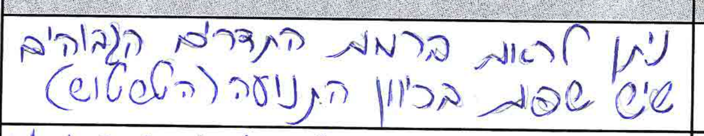

## e003_q1_r2
- exam: `test/003_70.pdf` | question 1 | sub-item/row 2
- candidate (UNVERIFIED): רק התדרים הגבוהים נשמרו ב-High pass לכן התדרים הנמוכים (כולל DC) מאופסים
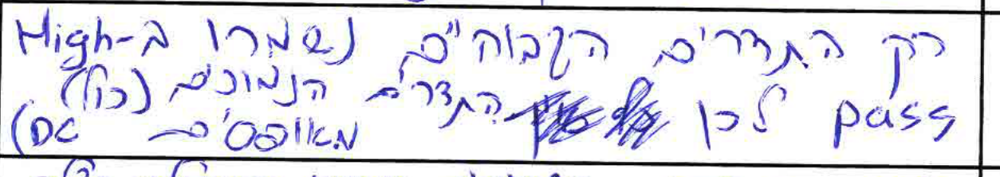

## e003_q1_r3
- exam: `test/003_70.pdf` | question 1 | sub-item/row 3
- candidate (UNVERIFIED): עוצמת התדרים הגבוהים שאחרי הפעולה עלה ולכן הרעש בתמונה מראה שפות עבות יותר
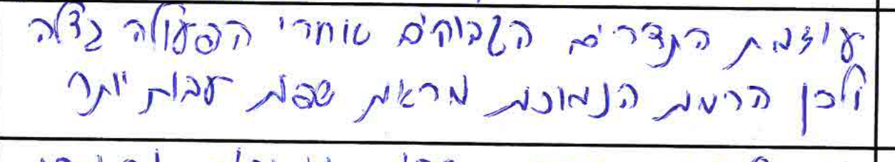

## e003_q1_r4
- exam: `test/003_70.pdf` | question 1 | sub-item/row 4
- candidate (UNVERIFIED): ניתן לראות שרק תדרים נמוכים נשמרו לכן גם הרמה של התדרים הגבוהים מאופסת
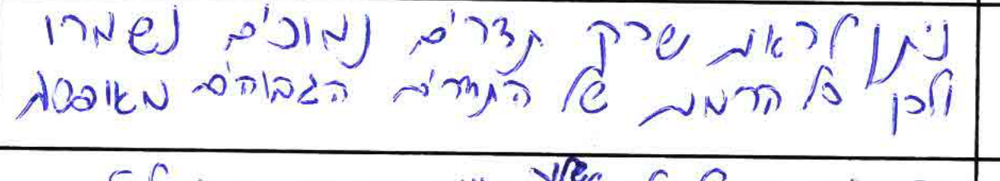

## e003_q1_r5
- exam: `test/003_70.pdf` | question 1 | sub-item/row 5
- candidate (UNVERIFIED): הרעש והטשטוש שלו בכיוון ציר ה-X מובלט בתדרים הגבוהים
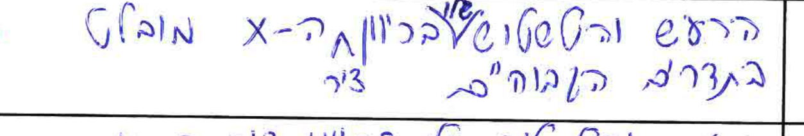

## e003_q1_r6
- exam: `test/003_70.pdf` | question 1 | sub-item/row 6
- candidate (UNVERIFIED): הרעש והטשטוש שלו בכיוון ציר ה-Y מובלט בתדרים הגבוהים
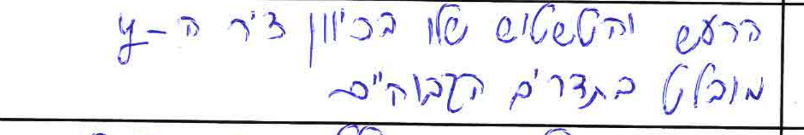

## e003_q1_r7
- exam: `test/003_70.pdf` | question 1 | sub-item/row 7
- candidate (UNVERIFIED): הרמה העליונה שכוללת את DC בהירה יותר
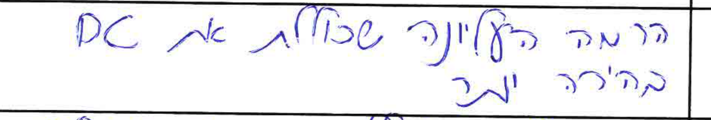

## e003_q1_r8
- exam: `test/003_70.pdf` | question 1 | sub-item/row 8
- candidate (UNVERIFIED): ברמה העליונה שכוללת את DC ניתן לראות שערכים בהירים יותר, נהיו יותר בהירים
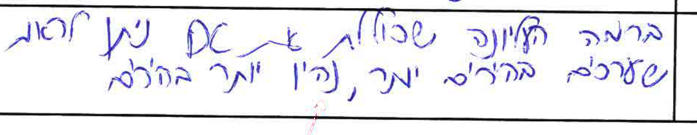

## e002_q1_r1
- exam: `test/002_76.pdf` | question 1 | sub-item/row 1
- candidate (UNVERIFIED): יש טשטוש בכל התמונה
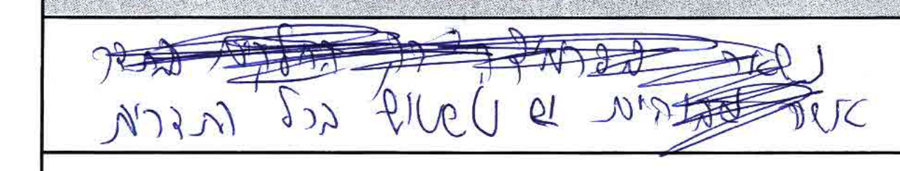

## e002_q1_r2
- exam: `test/002_76.pdf` | question 1 | sub-item/row 2
- candidate (UNVERIFIED): נשארו משמעותית רק התדרים הגבוהים
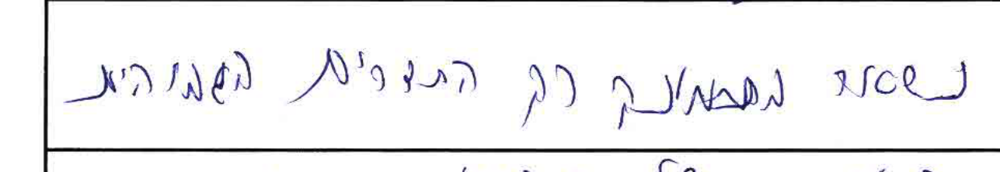

## e002_q1_r3
- exam: `test/002_76.pdf` | question 1 | sub-item/row 3
- candidate (UNVERIFIED): העוצמה של הצבעים הגבוהים בפרמידה חזקה ביחס למקורי.
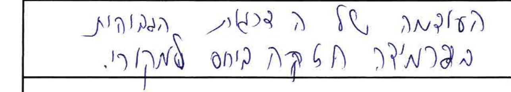

## e002_q1_r4
- exam: `test/002_76.pdf` | question 1 | sub-item/row 4
- candidate (UNVERIFIED): נשאר בתמונה רק התדרים הנמוכים
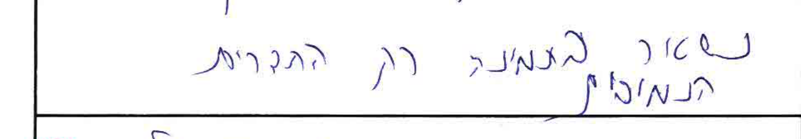

## e002_q1_r5
- exam: `test/002_76.pdf` | question 1 | sub-item/row 5
- candidate (UNVERIFIED): מריחה בציר X עקב הקונבולוציה
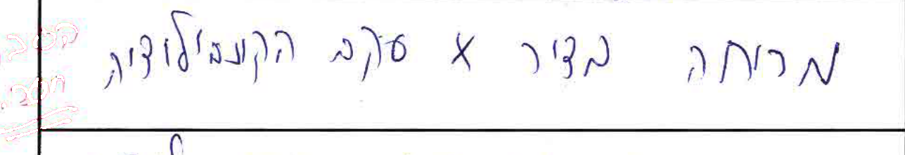

## e002_q1_r6
- exam: `test/002_76.pdf` | question 1 | sub-item/row 6
- candidate (UNVERIFIED): מריחה בציר Y עקב הקונבולוציה
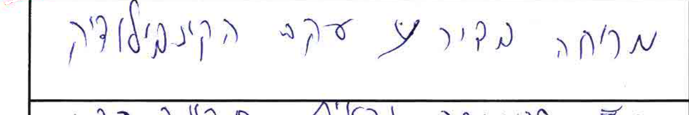

## e002_q1_r7
- exam: `test/002_76.pdf` | question 1 | sub-item/row 7
- candidate (UNVERIFIED): סהכ התמונה נראית תקינה בגרסה שלה בהירה משמעותית מהתמונה המקורית.
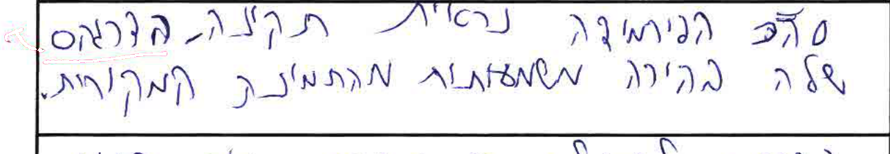

## e002_q1_r8
- exam: `test/002_76.pdf` | question 1 | sub-item/row 8
- candidate (UNVERIFIED): בדומה לפעולה 7, מבהיר את התמונה אבל פה הרזולוציות הבהירות יותר נעשות יותר שינוי מהרזולוציות הכהות
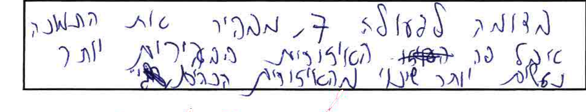

## rep_q1sheet_r1
- exam: `sample_data/student_exam.pdf` | question 1 (content; printed sheet title says 2 — student swap) | sub-item/row 1
- candidate (UNVERIFIED): רואים ארטיפקטים ברורים בכיוון ה motion של (באותה אוריינטציה וגם) כיוון ב 45
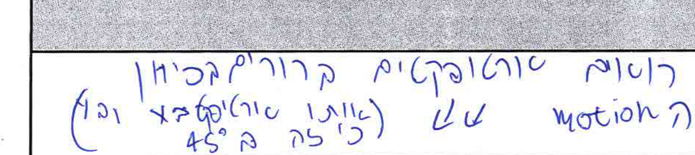

## rep_q1sheet_r2
- exam: `sample_data/student_exam.pdf` | question 1 (content; printed sheet title says 2 — student swap) | sub-item/row 2
- candidate (UNVERIFIED): טשטוש טווח HighPass מאופס את התמונה
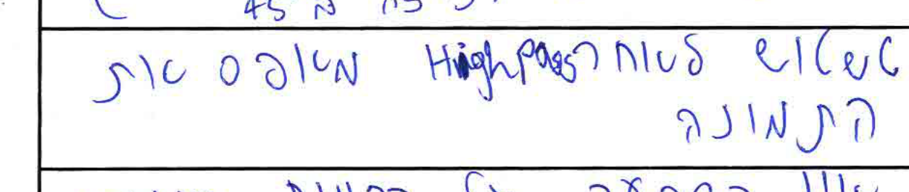

## rep_q1sheet_r3
- exam: `sample_data/student_exam.pdf` | question 1 (content; printed sheet title says 2 — student swap) | sub-item/row 3
- candidate (UNVERIFIED): אין השפעה על הרמות הנמוכות אבל הרמה הכי גבוהה בולטת יותר
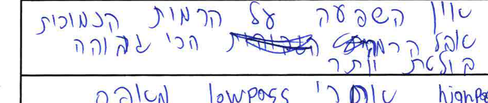

## rep_q1sheet_r4
- exam: `sample_data/student_exam.pdf` | question 1 (content; printed sheet title says 2 — student swap) | sub-item/row 4
- candidate (UNVERIFIED): (none)
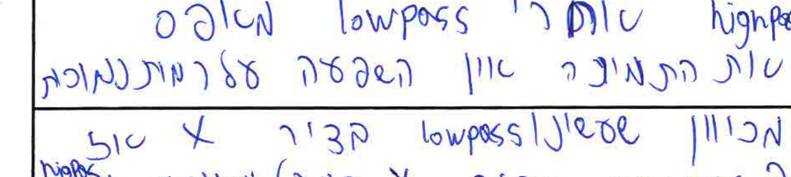
